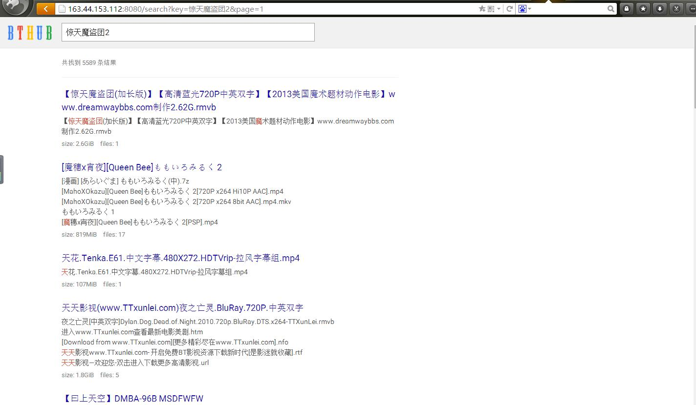
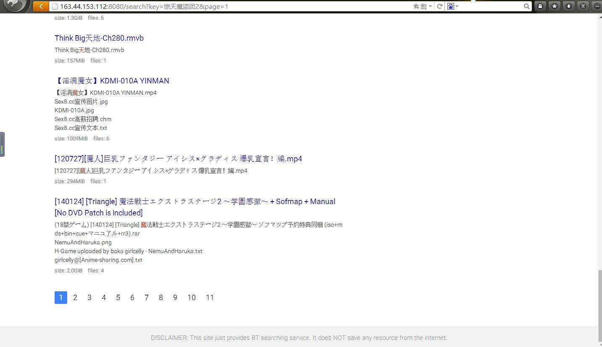

# gobtweb
A web interface of the project gobt, which is based on [iris](https://github.com/kataras/iris).

The template of the web is from http://bthub.io .

## Usage
### Installation
```
$ go get -u github.com/xgfone/gobtweb
$ go install github.com/xgfone/gobtweb
```

### Deployment
1. Modify the configuration file.
2. Start the program.

### Run
```
$ gobtweb /PATH/TO/gobtweb.conf
```

### Notice
1. The logfile is eithor an absolute or a relative path.
2. The level of the logger is one of debug, info, warn, error, crit.
3. It uses GORM as the DB ORM, so for the connection of DB, see [GORM](https://github.com/jinzhu/gorm).
4. The search engine is based on [elasticsearch](https://www.elastic.co), and only index the name of the torrent, so there are a little error in the results.

## Screenshot


